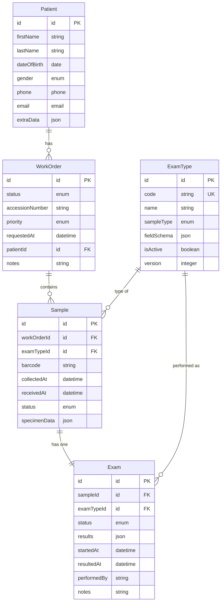

# Entity Relationship Diagram

```mermaid
erDiagram
    Patient ||--o{ WorkOrder : "has"
    WorkOrder ||--o{ Sample : "contains"
    ExamType ||--o{ Sample : "type of"
    Sample ||--|| Exam : "has one"
    ExamType ||--o{ Exam : "performed as"

    Patient {
        id id PK
        firstName string
        lastName string
        dateOfBirth date
        gender enum
        phone phone
        email email
        extraData json
    }

    WorkOrder {
        id id PK
        status enum
        accessionNumber string
        priority enum
        requestedAt datetime
        patientId id FK
        notes string
    }

    ExamType {
        id id PK
        code string UK
        name string
        sampleType enum
        fieldSchema json
        isActive boolean
        version integer
    }

    Sample {
        id id PK
        workOrderId id FK
        examTypeId id FK
        barcode string
        collectedAt datetime
        receivedAt datetime
        status enum
        specimenData json
    }

    Exam {
        id id PK
        sampleId id FK
        examTypeId id FK
        status enum
        results json
        startedAt datetime
        resultedAt datetime
        performedBy string
        notes string
    }
```
