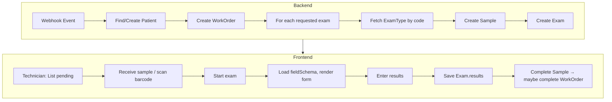

# Business Logic — How the Schema is Used in Practice

This document maps the flow of data through the LIS schema from two perspectives: backend (webhook ingestion) and frontend (technician workflows).

---

## 1. Backend Perspective — Webhook Ingestion

Work orders arrive as webhook events from an external system (e.g., EHR, clinic portal). Each event describes **one patient** and **one or more exams** to perform.

### 1.1 Webhook Payload (Expected Shape)

```typescript
interface WebhookPatient {
  externalId?: string;
  firstName: string;
  lastName: string;
  dateOfBirth: string; // ISO date
  gender: "M" | "F";
  phone?: string;
  email?: string;
}

interface WebhookRequestedExam {
  examTypeCode: string; // e.g. "URO", "HEM", "QS"
  notes?: string;
}

interface WebhookOrder {
  accessionNumber?: string;
  priority: "routine" | "urgent" | "stat";
  notes?: string;
  requestedExams: WebhookRequestedExam[];
}

interface WebhookEvent {
  patient: WebhookPatient;
  order: WebhookOrder;
}
```

### 1.2 Backend Handler

```typescript
async function handleWorkOrderWebhook(event: WebhookEvent): Promise<WorkOrder> {
  // 1. Upsert patient
  const patient = await findOrCreatePatient(event.patient);

  // 2. Create work order
  const workOrder = await client.models.WorkOrder.create({
    patientId: patient.id,
    status: "pending",
    accessionNumber: event.order.accessionNumber ?? generateAccessionNumber(),
    priority: event.order.priority,
    requestedAt: new Date().toISOString(),
    notes: event.order.notes,
  });

  // 3. For each requested exam type, create Sample + Exam
  for (const requestedExam of event.order.requestedExams) {
    const examType = await fetchExamTypeByCode(requestedExam.examTypeCode);
    if (!examType) {
      console.error(`Unknown exam type: ${requestedExam.examTypeCode}`);
      continue;
    }

    const sample = await client.models.Sample.create({
      workOrderId: workOrder.data.id,
      examTypeId: examType.id,
      status: "pending",
      barcode: generateBarcode(),
    });

    await client.models.Exam.create({
      sampleId: sample.data.id,
      examTypeId: examType.id,
      status: "pending",
      results: null,
    });
  }

  return workOrder.data;
}
```

### 1.3 Helper: Find or Create Patient

```typescript
async function findOrCreatePatient(
  patientInput: WebhookPatient
): Promise<Patient> {
  // Option A: match by external system ID if provided
  if (patientInput.externalId) {
    const { data } = await client.models.Patient.list({
      filter: {
        extraData: { externalId: { eq: patientInput.externalId } },
      },
    });
    if (data.length > 0) return data[0];
  }

  // Option B: match by identity (name + DOB) to avoid duplicates
  const { data: existing } = await client.models.Patient.list({
    filter: {
      firstName: { eq: patientInput.firstName },
      lastName: { eq: patientInput.lastName },
      dateOfBirth: { eq: patientInput.dateOfBirth },
    },
  });
  if (existing.length > 0) return existing[0];

  const { data: created } = await client.models.Patient.create({
    firstName: patientInput.firstName,
    lastName: patientInput.lastName,
    dateOfBirth: patientInput.dateOfBirth,
    gender: patientInput.gender,
    phone: patientInput.phone,
    email: patientInput.email,
    extraData: patientInput.externalId
      ? { externalId: patientInput.externalId }
      : null,
  });

  return created;
}
```

### 1.4 Helper: Fetch ExamType by Code

```typescript
async function fetchExamTypeByCode(code: string): Promise<ExamType | null> {
  const { data } = await client.models.ExamType.list({
    filter: { code: { eq: code } },
  });
  return data[0] ?? null;
}
```

---

## 2. Frontend Perspective — Technician Workflows

The consumer (frontend) is used by lab technicians to receive samples, perform exams, and enter results.

### 2.1 Workflow Overview

```
[Webhook] → WorkOrder + Samples + Exams (pending)
                ↓
Technician: List pending work orders / samples
                ↓
Technician: Receive sample (scan barcode) → Sample.status = "received"
                ↓
Technician: Start exam → Exam.status = "in-progress"
                ↓
Technician: Enter results (form driven by ExamType.fieldSchema)
                ↓
Technician: Complete exam → Exam.status = "completed", Sample.status = "completed"
                ↓
(Optional) If all samples in WorkOrder completed → WorkOrder.status = "completed"
```

### 2.2 List Pending Work Orders

```typescript
async function listPendingWorkOrders(): Promise<WorkOrderWithRelations[]> {
  const { data: workOrders } = await client.models.WorkOrder.list({
    filter: {
      or: [{ status: { ne: "completed" } }, { status: { ne: "cancelled" } }],
    },
  });

  const enriched = await Promise.all(
    workOrders.map(async (wo) => {
      const { data: samples } = await client.models.Sample.list({
        filter: { workOrderId: { eq: wo.id } },
      });
      const { data: patient } = await client.models.Patient.get({ id: wo.patientId });
      return { ...wo, samples, patient };
    })
  );

  return enriched;
}
```

### 2.3 List Pending Samples (Queue View)

```typescript
async function listSamplesByStatus(
  status: "pending" | "received" | "in-progress"
): Promise<SampleWithRelations[]> {
  const { data: samples } = await client.models.Sample.list({
    filter: { status: { eq: status } },
  });

  const enriched = await Promise.all(
    samples.map(async (s) => {
      const { data: workOrder } = await client.models.WorkOrder.get({
        id: s.workOrderId,
      });
      const { data: patient } = await client.models.Patient.get({
        id: workOrder!.patientId,
      });
      const { data: examType } = await client.models.ExamType.get({
        id: s.examTypeId,
      });
      const { data: exam } = await client.models.Exam.list({
        filter: { sampleId: { eq: s.id } },
      });
      return { ...s, workOrder, patient, examType, exam: exam[0] };
    })
  );

  return enriched;
}
```

### 2.4 Receive Sample (Barcode Scan)

```typescript
async function receiveSample(barcode: string): Promise<Sample> {
  const { data: samples } = await client.models.Sample.list({
    filter: { barcode: { eq: barcode } },
  });

  const sample = samples[0];
  if (!sample) {
    throw new Error("Sample not found");
  }

  const { data: updated } = await client.models.Sample.update({
    id: sample.id,
    status: "received",
    receivedAt: new Date().toISOString(),
  });

  return updated;
}
```

### 2.5 Load Exam Form (Get Field Schema)

```typescript
interface ExamFormData {
  exam: Exam;
  examType: ExamType;
  sample: Sample;
  patient: Patient;
  fieldSchema: FieldSchema;
}

async function loadExamForEntry(examId: string): Promise<ExamFormData> {
  const { data: exam } = await client.models.Exam.get({ id: examId });
  if (!exam) throw new Error("Exam not found");

  const { data: sample } = await client.models.Sample.get({
    id: exam.sampleId,
  });
  const { data: examType } = await client.models.ExamType.get({
    id: exam.examTypeId,
  });
  const { data: workOrder } = await client.models.WorkOrder.get({
    id: sample!.workOrderId,
  });
  const { data: patient } = await client.models.Patient.get({
    id: workOrder!.patientId,
  });

  return {
    exam,
    examType: examType!,
    sample: sample!,
    patient: patient!,
    fieldSchema: examType!.fieldSchema,
  };
}
```

### 2.6 Start Exam

```typescript
async function startExam(examId: string): Promise<Exam> {
  const { data: exam } = await client.models.Exam.get({ id: examId });
  if (!exam) throw new Error("Exam not found");

  await client.models.Exam.update({
    id: examId,
    status: "in-progress",
    startedAt: new Date().toISOString(),
    performedBy: getCurrentUserId(),
  });

  await client.models.Sample.update({
    id: exam.sampleId,
    status: "in-progress",
  });

  return { ...exam, status: "in-progress" };
}
```

### 2.7 Enter / Save Results

```typescript
interface FieldSchema {
  sections: {
    id: string;
    label: string;
    fields: {
      key: string;
      label: string;
      type: "string" | "numeric" | "enum";
      options?: string[];
      required?: boolean;
    }[];
  }[];
}

function validateResultsAgainstSchema(
  results: Record<string, unknown>,
  fieldSchema: FieldSchema
): void {
  for (const section of fieldSchema.sections) {
    for (const field of section.fields) {
      const value = results[field.key];
      if (field.required && (value == null || value === "")) {
        throw new Error(`Missing required field: ${field.key}`);
      }
      if (field.type === "numeric" && value != null && typeof value !== "number") {
        throw new Error(`Invalid type for ${field.key}`);
      }
      if (
        field.type === "enum" &&
        field.options &&
        value != null &&
        !field.options.includes(String(value))
      ) {
        throw new Error(`Invalid value for ${field.key}`);
      }
    }
  }
}

async function saveExamResults(
  examId: string,
  results: Record<string, unknown>
): Promise<void> {
  const { data: exam } = await client.models.Exam.get({ id: examId });
  if (!exam) throw new Error("Exam not found");

  const { data: examType } = await client.models.ExamType.get({
    id: exam.examTypeId,
  });
  if (!examType) throw new Error("Exam type not found");

  validateResultsAgainstSchema(results, examType.fieldSchema as FieldSchema);

  await client.models.Exam.update({
    id: examId,
    results,
    status: "completed",
    resultedAt: new Date().toISOString(),
  });

  await client.models.Sample.update({
    id: exam.sampleId,
    status: "completed",
  });

  await maybeCompleteWorkOrder(exam.sampleId);
}
```

### 2.8 Complete Work Order (When All Samples Done)

```typescript
async function maybeCompleteWorkOrder(sampleId: string): Promise<void> {
  const { data: sample } = await client.models.Sample.get({ id: sampleId });
  if (!sample) return;

  const { data: samples } = await client.models.Sample.list({
    filter: { workOrderId: { eq: sample.workOrderId } },
  });

  const allCompleted = samples.every((s) => s.status === "completed");
  if (allCompleted) {
    await client.models.WorkOrder.update({
      id: sample.workOrderId,
      status: "completed",
    });
  }
}
```

### 2.9 Render Dynamic Form from fieldSchema

```typescript
interface FormField {
  key: string;
  label: string;
  type: "text" | "number" | "select";
  options?: string[];
  referenceRange?: string;
  required: boolean;
}

function mapToInputType(
  fieldType: "string" | "numeric" | "enum"
): "text" | "number" | "select" {
  switch (fieldType) {
    case "numeric":
      return "number";
    case "enum":
      return "select";
    default:
      return "text";
  }
}

function renderExamForm(fieldSchema: FieldSchema): FormField[] {
  const fields: FormField[] = [];
  for (const section of fieldSchema.sections) {
    for (const field of section.fields) {
      fields.push({
        key: field.key,
        label: field.label,
        type: mapToInputType(field.type),
        options: field.options,
        referenceRange: (field as { referenceRange?: string }).referenceRange,
        required: field.required ?? false,
      });
    }
  }
  return fields;
}
```

---

## 3. Summary Flow Diagram



---

## 4. Key Data Dependencies

| Operation | Reads | Writes |
|-----------|-------|--------|
| Webhook handler | Patient (find), ExamType (by code) | Patient?, WorkOrder, Sample, Exam |
| Receive sample | Sample (by barcode) | Sample (status, receivedAt) |
| Start exam | Exam, Sample | Exam (status, startedAt), Sample (status) |
| Save results | Exam, ExamType (fieldSchema) | Exam (results, status), Sample (status), WorkOrder? (status) |
| List queue | WorkOrder, Sample, Patient, ExamType, Exam | — |
