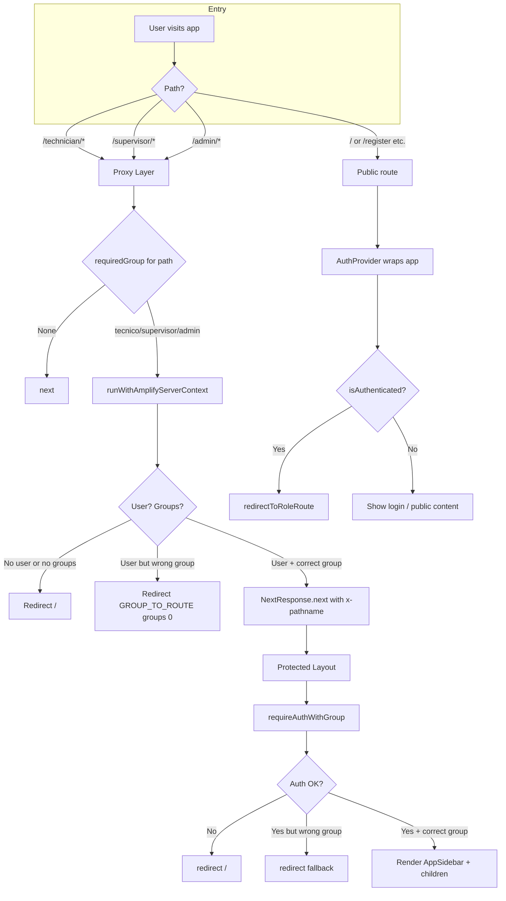
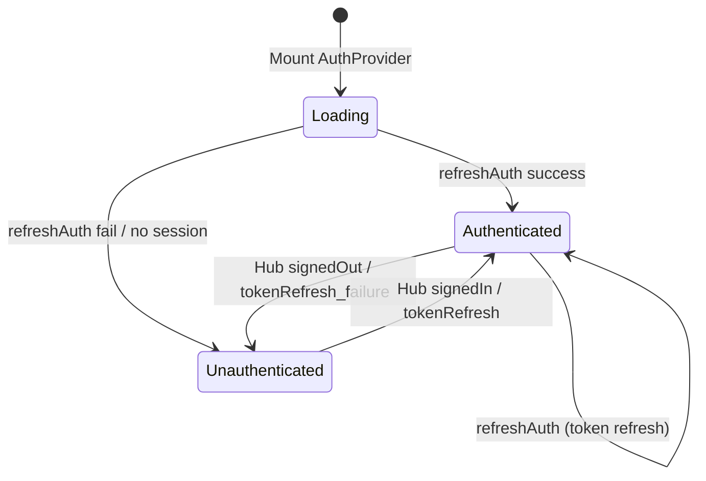
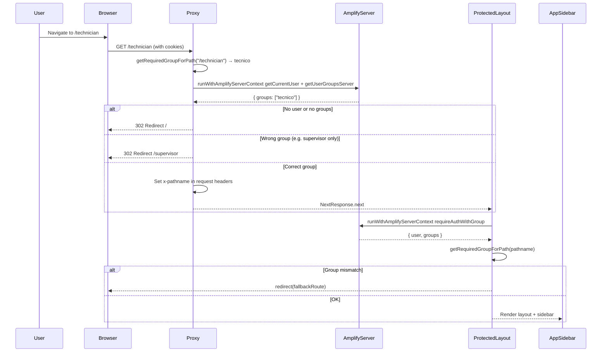
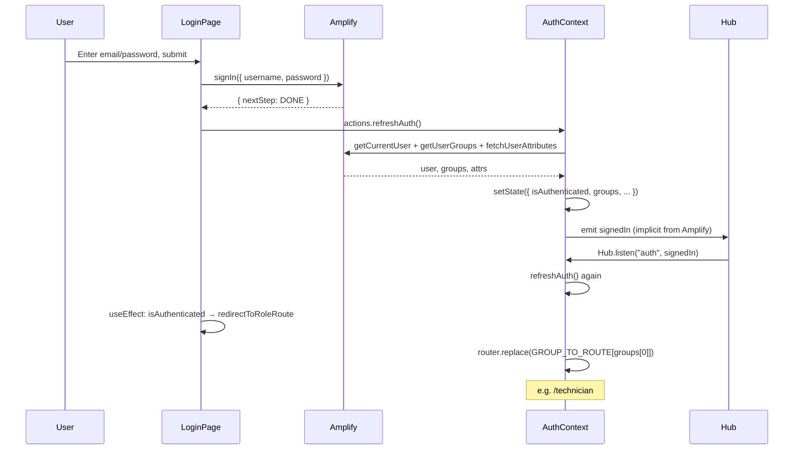
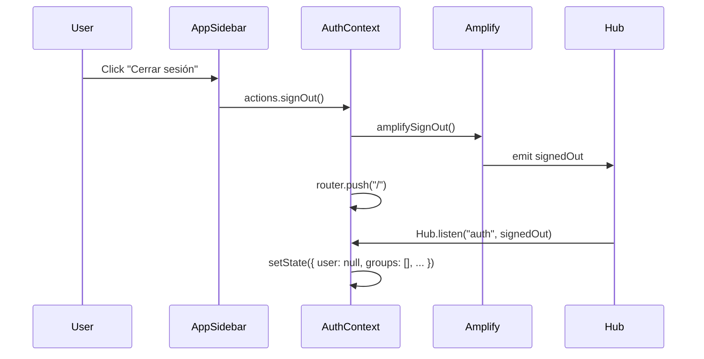
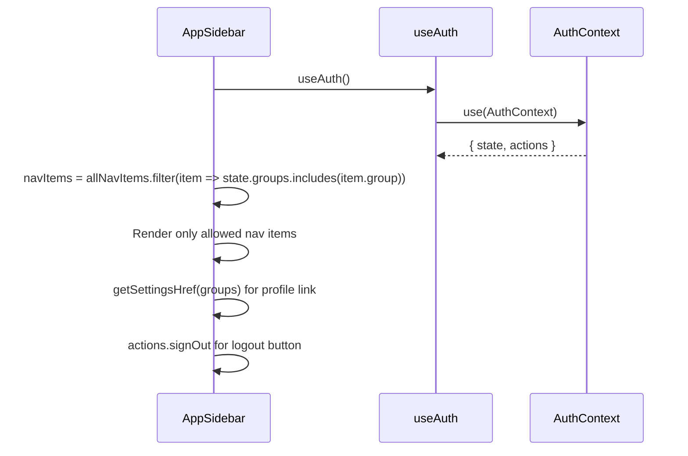

# Authentication Architecture Report

## Executive Summary

LabCore LIS uses **AWS Amplify Auth (Cognito)** with a layered security model: server-side middleware (proxy), server layout guards, and client-side context. Role-based access control (RBAC) is enforced via Cognito groups (`tecnico`, `supervisor`, `admin`) with path-based route protection.

---

## Table of Contents

1. [Architecture Overview](#1-architecture-overview)
2. [Directory & File Map](#2-directory--file-map)
3. [Auth Flow Charts](#3-auth-flow-charts)
4. [Sequence Diagrams](#4-sequence-diagrams)
5. [Component Deep Dive](#5-component-deep-dive)
6. [Data Flow Summary](#6-data-flow-summary)

---

## 1. Architecture Overview

### 1.1 Layered Defense Model

The application employs three layers of authentication/authorization:

| Layer | Location | Responsibility |
|-------|----------|----------------|
| **Layer 1: Proxy/Middleware** | `src/proxy.ts` | First-line server check. Blocks unauthenticated requests to protected paths. Redirects wrong-role users to their home route. |
| **Layer 2: Server Layout** | `src/app/(protected)/layout.tsx` | Server-side auth + group check for all `/technician`, `/supervisor`, `/admin` routes. Passes `x-pathname` to layout. |
| **Layer 3: Auth Context** | `src/contexts/auth-context.tsx` | Client-side state, Hub listeners, AuthGuard (if used), redirects for login page. |

### 1.2 Role & Route Mapping

```text
AuthGroup      → Route Prefix
────────────────────────────
tecnico        → /technician
supervisor     → /supervisor
admin          → /admin
```

**Priority order** (used when user has multiple groups): `admin > supervisor > tecnico`.

---

## 2. Directory & File Map

```text
src/
├── proxy.ts                    # Middleware/proxy: server-side route protection
├── app/
│   ├── layout.tsx              # Root layout: AuthProvider, ConfigureAmplifyClientSide
│   ├── page.tsx                # Login page (/) – redirects if authenticated
│   ├── forgot-password/
│   ├── register/
│   └── (protected)/
│       └── layout.tsx          # Server layout: requireAuthWithGroup, group-based redirect
│           ├── technician/     # tecnico group
│           ├── supervisor/    # supervisor group
│           └── admin/          # admin group
├── contexts/
│   └── auth-context.tsx        # AuthProvider, AuthGuard, useAuth, Hub listener
├── components/
│   └── app-sidebar.tsx         # Sidebar: uses useAuth for groups, signOut
├── lib/
│   ├── auth.ts                 # Client: getUserGroups, hasAccessToPath, GROUP_TO_ROUTE
│   └── auth-server.ts          # Server: getUserGroupsServer, requireAuthWithGroup
├── utils/
│   └── amplifyServerUtils.ts   # runWithAmplifyServerContext
└── components/
    └── ConfigureAmplifyClientSide.tsx  # Amplify.configure(outputs, { ssr: true })
```

---

## 3. Auth Flow Charts

### 3.1 High-Level Auth Flow (Mermaid)



### 3.2 Login Page Flow (Client-Side)

```mermaid
flowchart TB
    subgraph Login
        A[page.tsx Load] --> B[useAuth]
        B --> C[refreshAuth on mount]
        C --> D{isAuthenticated?}
        D -->|Yes| E[redirectToRoleRoute]
        D -->|No| F[Show login form]
    end

    subgraph Submit
        G[User submits credentials] --> H[signIn Amplify]
        H --> I{nextStep.signInStep}
        I -->|CONFIRM_SIGN_UP| J[/register?confirm=1]
        I -->|RESET_PASSWORD| K[/forgot-password]
        I -->|DONE| L[refreshAuth]
        I -->|Other| M[Show API error]
        L --> N[Hub signedIn]
        N --> O[refreshAuth in context]
        O --> P[useEffect: redirectToRoleRoute]
        P --> Q[Navigate to /technician etc]
    end
```

### 3.3 Auth State Lifecycle



---

## 4. Sequence Diagrams

### 4.1 Protected Route Request (Full Stack)



### 4.2 Login and Post-Login Redirect



### 4.3 Sign Out Flow



### 4.4 Sidebar Navigation Filtering



---

## 5. Component Deep Dive

### 5.1 `src/proxy.ts` (Middleware Layer)

**Purpose:** First line of defense for protected paths.

**Logic:**
1. Reads `pathname` from `request.nextUrl.pathname`.
2. Uses `getRequiredGroupForPath(pathname)` — returns `"tecnico" | "supervisor" | "admin" | null`.
3. If no required group → `NextResponse.next()` (pass through).
4. Runs `runWithAmplifyServerContext` with `{ cookies }`:
   - `getCurrentUser(ctx)`
   - `getUserGroupsServer(ctx)`
5. If no user/groups → redirect `/`.
6. If user’s groups don’t include required group → redirect `GROUP_TO_ROUTE[groups[0]]`.
7. On success → `NextResponse.next` with `x-pathname` header set.

**Matcher:** `/technician/:path*`, `/supervisor/:path*`, `/admin/:path*`.

**Note:** This file exports `proxy` and `config`. To act as Next.js middleware it should be wired via `middleware.ts` at project root (e.g. `export { proxy as default } from '@/proxy'`).

---

### 5.2 `src/lib/auth.ts` (Shared Auth Utilities)

| Export | Use | Description |
|--------|-----|-------------|
| `AUTH_GROUPS` | Both | `["tecnico", "supervisor", "admin"]` |
| `AuthGroup` | Both | Type for valid group names |
| `GROUP_TO_ROUTE` | Both | Map group → route prefix |
| `ROLE_PRIORITY` | Both | `["admin", "supervisor", "tecnico"]` |
| `getUserGroups()` | Client | Reads `cognito:groups` from `fetchAuthSession()` |
| `getRequiredGroupForPath(pathname)` | Both | Returns required group for path or null |
| `hasAccessToPath(userGroups, pathname)` | Client | `userGroups.includes(requiredGroup)` |
| `getDefaultRoleRoute()` | Client | Highest-priority group’s route |

---

### 5.3 `src/lib/auth-server.ts` (Server Auth)

| Export | Description |
|--------|-------------|
| `getUserGroupsServer(ctx)` | Reads groups from `fetchAuthSession(ctx)` inside Amplify context |
| `requireAuthWithGroup(ctx, requiredGroup?)` | Throws if no user or missing required group |

---

### 5.4 `src/contexts/auth-context.tsx`

**Provider (`AuthProviderInner`):**
- State: `user`, `groups`, `userEmail`, `userName`, `isLoading`, `isAuthenticated`.
- Actions: `refreshAuth`, `redirectToRoleRoute`, `signOut`.
- On mount: calls `refreshAuth()`.
- Hub listener: `signedIn` / `tokenRefresh` → `refreshAuth`; `signedOut` / `tokenRefresh_failure` → clear state.

**AuthGuard (if used):**
- Reads `state` and `pathname`.
- If not loading and not authenticated → `router.replace("/")`.
- If not loading and `!hasAccessToPath(groups, pathname)` → redirect to `GROUP_TO_ROUTE[groups[0]]`.
- Shows `AuthLoading` while loading; `null` when redirecting; children when allowed.

**useAuth:** React 19 `use(AuthContext)`.

---

### 5.5 `src/app/layout.tsx` (Root Layout)

```tsx
<ConfigureAmplifyClientSide />
<AuthProvider>
  <TooltipProvider>{children}</TooltipProvider>
</AuthProvider>
```

- `ConfigureAmplifyClientSide`: `Amplify.configure(outputs, { ssr: true })`.
- `AuthProvider`: Wraps the app and provides auth state/actions.

---

### 5.6 `src/app/page.tsx` (Login Page)

- Uses `useAuth()` and `useForm`.
- `useEffect`: If `isAuthenticated` and not loading → `redirectToRoleRoute()`.
- `onSubmit`: `signIn` → handles `CONFIRM_SIGN_UP`, `RESET_PASSWORD`, `DONE`, or shows API error.
- On `DONE`: `refreshAuth()` and relies on `useEffect` to redirect.

---

### 5.7 `src/app/(protected)/layout.tsx` (Protected Layout)

1. `connection()` (Next.js drain).
2. Reads `x-pathname` from headers (set by proxy).
3. `runWithAmplifyServerContext` + `requireAuthWithGroup(ctx)`.
4. If error → `redirect("/")`.
5. If `requiredGroup` and user not in group → `redirect(fallbackRoute)`.
6. Otherwise renders: `SidebarProvider`, `AppSidebar`, `SidebarInset`, `children`.

---

### 5.8 `src/components/app-sidebar.tsx`

- `useAuth()` for `state` and `actions`.
- `navItems = allNavItems.filter(item => authState.groups.includes(item.group))`.
- `getSettingsHref(groups)` for profile link.
- `actions.signOut()` for logout.

---

## 6. Data Flow Summary

| Source | Destination | Data |
|--------|-------------|------|
| Cognito | `fetchAuthSession` / `getCurrentUser` | JWT, `cognito:groups` |
| Cookies | `runWithAmplifyServerContext({ cookies })` | Session tokens |
| Proxy | Protected layout | `x-pathname` header |
| AuthContext | Login page, AppSidebar, AuthGuard | `state`, `actions` |
| Hub | AuthContext | `signedIn`, `signedOut`, `tokenRefresh` |

---

## Appendix: Route Structure

```text
/                     → Login (page.tsx)
/register             → Registration (public)
/forgot-password      → Password reset (public)
/technician/*         → tecnico group
/supervisor/*         → supervisor group
/admin/*              → admin group
/support              → Linked from sidebar (not role-restricted in docs)
```
