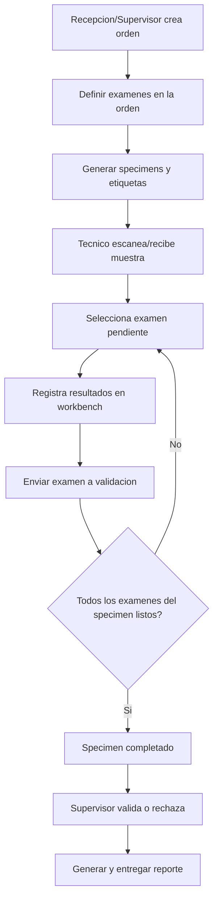

# Flujo End-to-End de Laboratorio (LabCore)

Este documento describe el flujo operativo completo desde el origen de la orden hasta la trazabilidad final de resultados, con enfoque por rol y etapas del proceso.

## Objetivo

Definir un flujo realista para clínicas/laboratorios donde el trabajo del técnico **no inicia el proceso**, sino que comienza después de la creación de orden y generación de muestras.

---

## Diagrama de Flujo Principal

---

## Flujo por Etapas y Roles

## A) Origen del trabajo (pre-técnico)

### A1. Crear orden
- **Rol:** Recepción o Supervisor.
- **Vista:** `Nueva Orden` (Order Intake).
- **Datos capturados:** paciente, médico (opcional), prioridad, exámenes, notas.
- **DB:** `orders`, `order_tests`.
- **Audit:** `ORDER_CREATED`, `ORDER_TESTS_ADDED`.

### A2. Generar muestras y etiquetas
- **Rol:** Recepción o Técnico de recepción.
- **Vista:** `Asignación de Muestras / Etiquetas`.
- **Regla clave:** agrupar exámenes compatibles en el mismo `specimen`.
- **DB:** `specimens`, `order_tests.specimen_id`.
- **Audit:** `SPECIMENS_GENERATED`, `LABELS_PRINTED`, `ORDER_TEST_ASSIGNED_TO_SPECIMEN`.

> Aquí nace la cola operativa del técnico.

---

## B) Flujo del Técnico (operación)

### B1. Login
- **Rol:** Técnico.
- **Vista:** `Login`.
- **Audit:** `AUTH_LOGIN`.

### B2. Dashboard técnico
- **Vista:** `Dashboard Técnico`.
- **Muestra:** pendientes, urgentes, prioridades.
- **Audit:** `VIEW_DASHBOARD`.

### B3. Escaneo/recepción de muestra
- **Vista:** `Muestras` (scan) o modal de escaneo.
- **Entrada:** `specimen_code`.
- **DB:** `specimens.status = RECEIVED` (si aplica), `specimen_scan_events` o `audit_events`.
- **Audit:** `SPECIMEN_SCANNED`, `SPECIMEN_RECEIVED`.

### B4. Selección de examen
- **Vista:** `Detalle de muestra`.
- **Acción:** abrir examen pendiente para procesar.
- **Audit:** `SPECIMEN_VIEWED`, `ORDER_TEST_OPENED`.

### B5. Workbench y captura de resultados
- **Vista:** `Procesar Examen`.
- **DB:** upsert en `results`; `order_tests.status = IN_PROGRESS`.
- **Audit:** `RESULT_UPDATED`, `ORDER_TEST_IN_PROGRESS`.

### B6. Enviar a validación
- **Vista:** confirmación de finalización.
- **DB:** `order_tests.status = READY_FOR_VALIDATION`, opcional `completed_at`.
- **Audit:** `ORDER_TEST_READY_FOR_VALIDATION`.

### B7. Completar muestra (automático)
- **Condición:** todos los `order_tests` del `specimen` en estado listo/aprobado.
- **DB:** `specimens.status = COMPLETED` (o `READY_FOR_VALIDATION` según modelo).
- **Audit:** `SPECIMEN_COMPLETED`.

---

## C) Post-técnico (cierre de ciclo)

### C1. Validación
- **Rol:** Supervisor.
- **Vista:** `Validación`.
- **Acciones:** aprobar, rechazar, comentar, devolver.
- **DB:** `order_tests.status = APPROVED | REJECTED`, `validated_by`, `validated_at`.
- **Audit:** `ORDER_TEST_APPROVED`, `ORDER_TEST_REJECTED`.

### C2. Reporte y entrega
- **Rol:** Recepción o Supervisor.
- **Vista:** `Reportes`.
- **Salida:** PDF de orden con branding del laboratorio.
- **Audit:** `REPORT_GENERATED`, `REPORT_DELIVERED` (opcional).

---

## Respuestas clave de negocio

- **Donde se origina todo:** en `Nueva Orden` y `Generar Muestras/Etiquetas`.
- **El técnico inicia el flujo principal:** no; normalmente ejecuta trabajo ya creado.
- **Excepción permitida:** modo rapido de orden para laboratorios pequenos (walk-in), no recomendado como flujo base para clinicas.

---

## Vistas mínimas para MVP end-to-end

1. `Nueva Orden`
2. `Generar Muestras / Imprimir etiquetas`
3. `Dashboard Técnico`
4. `Muestras (escaneo + detalle)`
5. `Procesar Examen (resultados + enviar a validación)`

Con estas 5 vistas se puede demostrar trazabilidad completa:

**orden -> muestras -> escaneo -> resultados -> validación -> reporte**

---

## Notas de implementación sugeridas

- Mantener una maquina de estados explícita para `order_tests` y `specimens`.
- Registrar eventos de auditoría en cada transición relevante.
- Asegurar idempotencia en escaneo y actualización de resultados.
- Definir SLA/alertas para urgentes desde el dashboard técnico.
